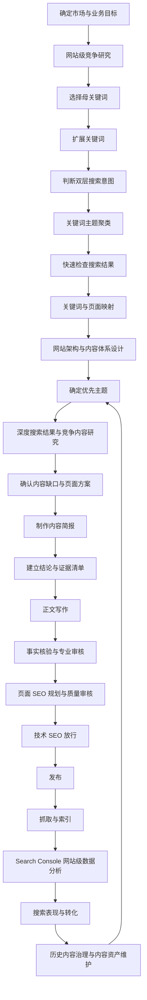

# SEO 研究与网站优化总流程

本文件说明整套指南的定位、研究层级和标准流程。具体操作分别拆到后续模块中。

## 1. 指南定位

这是一套适用于产品型网站的 SEO 研究与网站优化标准流程。它不是单纯的写作提示词，而是一条从商业目标、关键词、竞争研究、网站架构、单页内容到技术发布与数据复盘的完整证据链。

指南已经使用 `Composite Decking` 与 `WPC Wall Cladding` 验证核心流程，并增加 Trex.com 网站级竞争研究示例。使用其他产品时，应替换市场、客户、产品事实、竞争网站和实际搜索结果，不应机械复制案例中的页面、栏目和数据。

---

## 2. 三个研究层级

SEO 研究建议区分竞争网站级、我们的网站级和单页级。

| 层级 | 主要问题 | 主要产物 |
|---|---|---|
| 竞争网站级研究 | 竞争网站怎样组织产品、内容、工具和转化？ | 网站结构观察、页面类型矩阵、竞争优势与可行动结论 |
| 我们的网站级研究 | 我们应该建立哪些页面，并怎样互相连接？ | 主题地图、关键词主题组、页面映射、站点架构 |
| 单页级研究 | 某一个页面应该怎样做？ | 搜索结果分析、用户问题、内容缺口、内容简报、正文 |

竞争网站研究用于提供外部参照，但不能代替自身业务目标和关键词研究。如果跳过网站级规划直接写文章，仍然容易出现关键词内耗、页面类型错误和内容无法支持核心产品页的问题。

---

## 3. 完整工作流

---

## 4. 为什么有两次搜索结果检查

关键词研究和单篇内容研究都会使用 Google 搜索结果，但深度不同。

### 关键词阶段：快速验证

目的：

- 判断搜索意图
- 判断主要页面类型
- 辅助关键词聚类
- 判断两个相似关键词是否可能由同一页面承接

不要求逐页深度研究竞争内容。

### 单页阶段：深度研究

当某个主题确定要制作后，再进行：

- 搜索结果整体结构分析
- 代表性竞争页面分析
- 共同决策维度整理
- 结论与证据矩阵
- 用户问题收集
- 来源偏向分析
- 内容缺口分析
- 原创证据规划
- 页面方案确认

这样可以避免对几十、几百个关键词都做高成本的完整竞争研究。

---

## 5. 使用原则

1. 先确定市场、客户、产品与转化目标。
2. 新站、改版或重要产品项目应建立网站级竞争参照，但不照抄竞争网站。
3. 竞争网站的公开事实、第三方估算和分析判断必须分开记录。
4. 先判断搜索意图，再决定页面类型。
5. 不采用“一个关键词一篇文章”的机械做法。
6. 一个重要主题应有一个主要承接页面。
7. 竞争页面和竞争网站用于研究，不用于拼接、改写或功能照搬。
8. AI 可以辅助整理、扩展与初稿，但不能代替真实数据、原始资料和技术审核。
9. 页面 SEO 从页面规划阶段开始，不在正文完成后机械补关键词。
10. 页面发布前先完成基础技术放行，避免内容质量被抓取、索引、Canonical 或状态码问题掩盖。
11. 发布不是结束，必须保留后续数据复盘和更新记录。
12. 网站进入稳定运营后，应定期做内容资产治理，不因为内容“旧”或流量低就自动删除。

---

## 6. 标准阶段门

| 阶段 | 完成标准 |
|---|---|
| 项目范围 | 市场、客户、产品和主要转化已确定 |
| 竞争网站研究 | 新站 / 改版 / 重要产品项目已记录代表性竞争网站、网站结构、页面类型和可行动结论；单页小更新可按需跳过 |
| 关键词原始池 | 母关键词、扩展维度、数据来源已记录 |
| 搜索意图 | 重要关键词已完成主搜索意图和业务 / 使用意图判断 |
| 关键词主题组 | 每个重要主题已有明确边界 |
| 页面映射 | 每个重要主题已有页面类型、目标网址和页面状态 |
| 网站架构 | 新站 / 改版 / 重要产品项目已明确页面类型、产品与内容层级、导航、URL、内部链接和转化路径；单页项目可按需跳过 |
| 深度搜索结果研究 | 搜索结果快照、代表性页面、证据矩阵、用户问题、来源偏向和内容缺口已记录 |
| 内容简报 | 页面目标、结构、证据、图片、AI 使用边界和行动引导已确定 |
| 证据清单 | 重要结论已明确证据来源、负责人和状态 |
| 初稿 | 正文完整，不存在未标记的关键事实空缺 |
| 审核 | 事实、专业与可信度审核完成，无未解决的关键高风险结论 |
| 页面 SEO | SEO 标题、主标题、网址、图片、内部链接、锚文本、面包屑和转化入口已检查 |
| 技术 SEO | 抓取、索引许可、Canonical、Sitemap、状态码、渲染、结构化数据与基础性能已检查 |
| 发布 | 正式网址、页面内容和转化路径已正确上线 |
| 发布后观察 | 已确认抓取与索引状态，并建立单页 Search Console、转化与维护记录 |
| 网站级数据分析 | 已按全站、品牌 / 非品牌、页面组、页面、查询词、国家和设备完成分层判断，并把事实、判断和动作分开记录 |
| 历史内容治理 | 已盘点重要历史页面，明确保持、更新、合并、重构或移除动作，并完成 URL、内部链接、Sitemap 与后续验证规划 |

---

## 7. 竞争网站研究如何接入流程

新站、网站改版或重要产品体系规划时，使用 [竞争网站研究：从单页分析升级到网站级判断](../02-research/competitor-site-research.md)：

- 研究竞争网站的业务模式、导航与产品体系。
- 建立页面类型矩阵，而不是只统计博客文章。
- 观察内容、产品、工具、技术资料和转化之间的关系。
- 区分公开网站事实、第三方流量 / 外链估算和分析判断。
- 识别值得补齐的基础能力、可形成的差异化和无法直接复制的品牌 / 渠道资源。

竞争网站研究通常是项目级或周期性任务，不需要为每一篇文章重新完整执行。

---

## 8. 网站架构如何接入流程

当关键词主题与页面映射已经基本明确后，新站、网站改版或重要产品体系项目应使用 [网站架构与内容体系设计](../03-architecture/site-architecture.md)：

- 把产品大类、系列和单品组织成真实业务层级。
- 把比较、安装、维护、技术资料、下载、案例和工具按用户任务组织。
- 设计主导航、二级导航、URL 和面包屑规则。
- 建立层级链接、主题链接以及内容到商业页面的内部链接关系。
- 明确技术资料、PDF、案例和工具怎样与产品建立关系。
- 区分正式 SEO 分类页与筛选 / 排序 / 站内搜索产生的界面状态。
- 设计信息型、产品型和专业用户从搜索入口到转化的路径。
- 旧站改版时建立 URL 迁移映射，不因为新架构更整齐就随意修改稳定网址。

网站架构主要通过页面职责和真实链接关系表达，不把 URL 目录深度当成唯一层级依据。

---

## 9. 页面 SEO 如何接入流程

页面内容准备完成后，使用 [页面 SEO：从研究结果到可发布页面](../05-optimization/on-page-seo.md) 统一检查：

- SEO 标题与 Meta Description。
- H1-H6 内容层级。
- 目标网址。
- 图片与 Alt。
- 内部链接与锚文本。
- 面包屑。
- 产品、资料、样品或询价等下一步入口。

页面 SEO 不使用固定关键词密度、标题字符数、H2 数量或内部链接数量。

---

## 10. 技术 SEO 如何接入流程

页面 SEO 完成后，使用 [技术 SEO：从可访问到可索引、可理解与可加载](../05-optimization/technical-seo.md) 进行技术放行：

- Googlebot 是否可以访问重要页面。
- 页面是否允许索引。
- Canonical 与规范网址信号是否一致。
- Sitemap 是否只提交目标规范网址。
- HTTP 状态码与重定向是否符合页面真实状态。
- JavaScript 渲染后主要内容和链接是否仍然可见。
- 结构化数据是否与真实页面一致。
- 移动端与 Core Web Vitals 是否存在明显阻断问题。

技术 SEO 不替代页面内容质量，也不把 Schema、Canonical 或 Sitemap 当成额外排名公式。

---

## 11. Google Search Console 网站级分析如何接入流程

当网站已经有多个产品目录、内容类型和稳定搜索数据后，使用 [Google Search Console 网站级数据分析](../06-measurement/search-console-analysis.md)：

- 先看全站趋势，再拆品牌 / 非品牌。
- 按网站架构拆产品目录、内容目录、技术资料和案例等页面组。
- 找出重点增长 / 下降页面和查询词。
- 使用“查询词 × 页面”判断真正的页面职责冲突。
- 分析目标国家 / 地区与设备差异。
- 判断新内容是否带来主题组真实增量。
- 改版项目按全站、页面组和重点 URL 分层比较。
- 最后再结合网站分析、表单和 CRM 判断业务价值。

网站级 Search Console 分析用于发现问题；锁定具体页面后，再进入单页发布后复盘。

---

## 12. 历史内容治理如何接入流程

当网站运营时间较长、页面数量增加或经历多次改版后，使用 [历史内容治理与内容资产维护](../07-governance/content-governance.md)：

- 建立全站或重点目录内容资产清单。
- 先确认页面职责、真实需求和业务价值，再判断是否需要治理。
- 区分内容衰退、搜索需求变化、页面类型错误和技术问题。
- 对重复页面决定重新分工、更新、合并或重构，而不是简单删除。
- 对停产产品、历史活动、技术资料和 PDF 按真实业务用途处理。
- 合并 / 迁移后同步更新重定向、Canonical、Sitemap、内部链接和重要外部引用。
- 使用 Search Console 观察查询是否逐步集中到正确页面，并保留修改记录。

历史内容治理是周期性的网站级任务，不要求所有页面按固定时间重写。

---

## 13. 使用 AI 的边界

完整的 AI 辅助工作方法参见 [AI 辅助 SEO 研究与内容生产](../04-content/ai-assisted-seo.md)。

AI 适合：

- 扩展关键词维度
- 整理搜索结果资料
- 辅助关键词聚类
- 结构化研究记录
- 生成内容简报初稿
- 辅助写作、翻译和可读性优化
- 根据检查表执行初审

AI 不能替代：

- Google Keyword Planner 和 Google Search Console 的真实数据
- 原始标准与法规
- 公司产品参数与测试报告
- 真实项目和客户证据
- 技术人员最终审核

---

## 14. 如何开始一个新项目

1. 填写市场、客户、产品和主要转化目标。
2. 对新站、改版或重要产品项目，使用 [竞争网站研究模板](../../templates/02-research/competitor-site-research.md) 建立 3—6 个代表性竞争网站参照。
3. 复制关键词研究模板并选择一个母关键词。
4. 建立关键词原始池并完成双层意图判断。
5. 完成主题聚类与页面映射。
6. 新站、改版或重要产品项目使用 [网站架构与内容体系模板](../../templates/03-architecture/site-architecture.md) 设计产品层级、内容体系、导航、URL、内部链接和转化路径。
7. 确定第一批高优先级页面。
8. 对准备制作的具体主题进行深度搜索结果研究。
9. 完成内容简报后再写正文。
10. 使用 [页面 SEO 规划模板](../../templates/05-optimization/page-seo.md) 把页面职责落实到标题、网址、图片、链接和转化入口。
11. 使用 [技术 SEO 审计与修复模板](../../templates/05-optimization/technical-seo.md) 或 [技术 SEO 检查表](../../checklists/05-optimization/technical-seo.md) 完成技术放行。
12. 发布后记录基线，检查抓取与索引。
13. 使用 [Google Search Console 网站级分析模板](../../templates/06-measurement/search-console-analysis.md) 按全站、页面组、页面、查询、国家和设备观察真实表现。
14. 对发现的具体问题页面使用单页发布后维护模板深入分析。
15. 根据证据选择保持、微调、更新、扩展、合并、重构、移除或继续观察。
16. 对运营多年或经历改版的网站，定期使用 [历史内容治理模板](../../templates/07-governance/content-governance.md) 进行网站级资产盘点，并记录 URL 与技术迁移动作。
